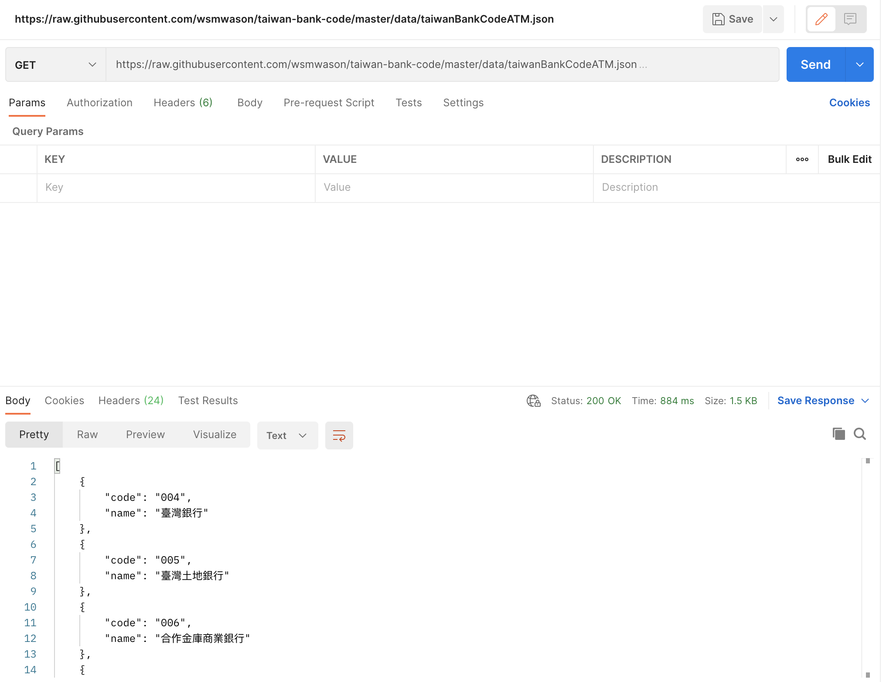
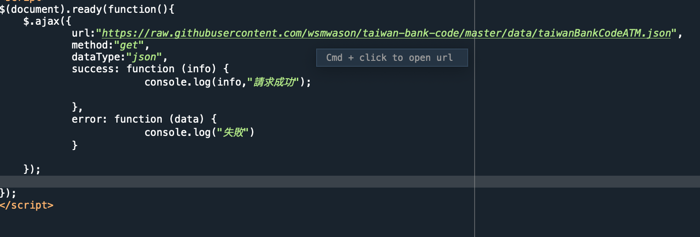
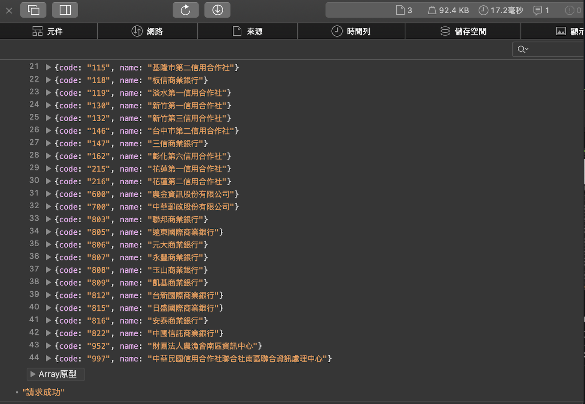

# Ｗeb-Ajax

## 使用語言

- 語言:JavaScript/HTML/CSS

## 主要功能

- 在Postman測試API。
- Ajax請求抓取網頁
- 利用console.log確認資料是否抓取成功。
- 最後利用bootstrap簡易美化版面。

## 過程截圖
### 目標API測試
- 目標API，利用Postman測試API是否可以使用：
 

### 初步網頁架構
- HTML架構 寫出表格
 

### Ajax請求抓取網頁
- Javascript
 

### 利用console.log確認資料是否抓取成功，並且測試指定抓取前三筆資料。

## 將抓取的資料使用$(#"類別").append 寫入HTML表格

## 最後畫面呈現

## 開發環境
- Spyder
- Javasscript
- HTML
- CSS

## 專案開發人員

> [Chris Lo](https://github.com/Chrislo-coding)
